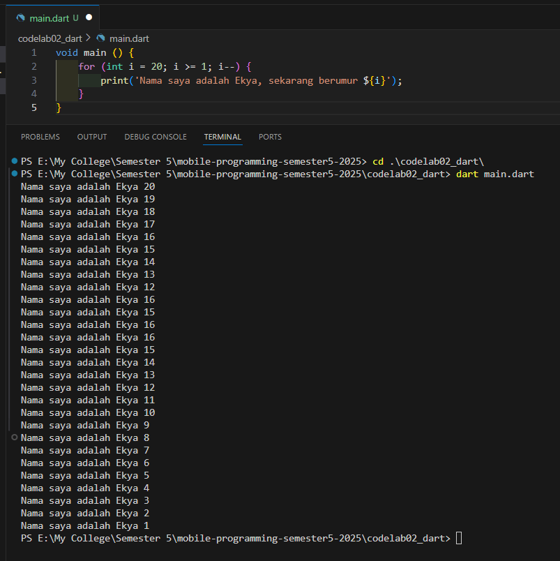

#No 1 : Modifikasilah kode pada baris 3 di VS Code atau Editor Code favorit Anda berikut ini agar mendapatkan keluaran (output) sesuai yang diminta!

#No 2 : Mengapa sangat penting untuk memahami bahasa pemrograman Dart sebelum kita menggunakan framework Flutter ? Jelaskan!
Penting, Sama seperti belajar berbicara sebelum belajar berpidato

#No 3 : Rangkumlah materi dari codelab ini menjadi poin-poin penting yang dapat Anda gunakan untuk membantu proses pengembangan aplikasi mobile menggunakan framework Flutter.
Flutter sangat fleksibel sekali dan sangat penting untuk meminimalisir baris dalam sebuah file untuk memudahkan maintenance

#No 4 : Buatlah penjelasan dan contoh eksekusi kode tentang perbedaan Null Safety dan Late variabel !
? artinya memberi tahu bahwa variabel ini bisa null
late variabel adalah meyakinkan proyek bahwa kita pasti akan meletakkan nilai di variabel ini maka sebelum variabel ini ada nilai, variabel ini tidak akan bisa dipanggil.
