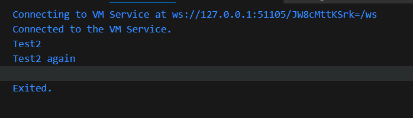
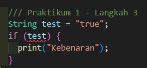
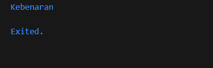
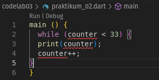
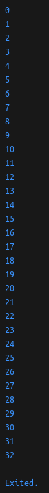
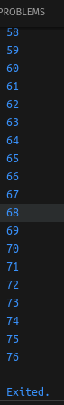
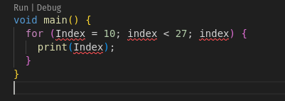
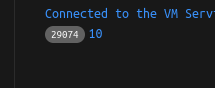
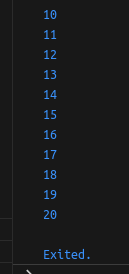

# Modul 3 - Pemrograman Mobile

Modul Pada pengantar bahasa pemrograman Dart bagian 3 ini, Saya akan melakukan praktik untuk bereksperimen dengan control flows (if/else) dan perulangan. Hal ini cukup penting diketahui terutama bagi Anda yang belum memiliki dasar pemrograman sebelumnya.


## Praktikum 1

#### Langkah 1 :

```
  String test = "test2";
if (test == "test1") {
   print("Test1");
} else If (test == "test2") {
   print("Test2");
} Else {
   print("Something else");
}

if (test == "test2") print("Test2 again");
```

#### Langkah 2 :

Silakan coba eksekusi (Run) kode pada langkah 1 tersebut. Apa yang terjadi? Jelaskan!




Pertama tama variabel test diinisiasi dengan String test2. Karena terkena if dan tidak ada perubahan nilai, maka terkena if dua kali dan mengeluarkan hasil seperti gambar diatas. 

#### Langkah 3 :

Tambahkan kode program berikut, lalu coba eksekusi (Run) kode Anda.

```
  String test = "true";
  if (test) {
    print("Kebenaran");
  }
```

<br>

Hasil :  


Apa yang terjadi ? Jika terjadi error, silakan perbaiki namun tetap menggunakan if/else.

Error karena true diinisiasi sebagai String dengan "". Untuk menjalankannya harus ditambahkan == "true"
```
  String test = "true";
  if (test == 'true') {
    print("Kebenaran");
  }
```
Hasil :  



<br>  

## Praktikum 2

#### Langkah 1 :

```
main() {
  while (counter < 33) {
    print(counter);
    counter++;
  }
}
```

#### Langkah 2 :

Silakan coba eksekusi (Run) kode pada langkah 1 tersebut. Apa yang terjadi? Jelaskan! Lalu perbaiki jika terjadi error.




Tidak ada variabel counter yang di inisiasi, sehingga ketika dipanggil error karena tidak ada variabel 'counter'.
```
main() {
  int counter = 0;
  while (counter < 33) {
    print(counter);
    counter++;
  }
}
```
Hasil :  




#### Langkah 3 :

Tambahkan kode program berikut, lalu coba eksekusi (Run) kode Anda.

```
  do {
    print(counter);
    counter++;
  } while (counter < 77);
```

<br>

Hasil :  


Apa yang terjadi ? Jika terjadi error, silakan perbaiki namun tetap menggunakan if/else.

Tidak ada error karena counter sudah ditambahkan pada langkah 2.

<br>  

## Praktikum 3

#### Langkah 1 :

```
void main() {
  for (Index = 10; index < 27; index) {
    print(Index);
  }
}
```

#### Langkah 2 :

Silakan coba eksekusi (Run) kode pada langkah 1 tersebut. Apa yang terjadi? Jelaskan! Lalu perbaiki jika terjadi error.



Penamaan variabel tidak ada tipe data dan tidak jelas (satu Index dan satu index). Untuk memperbaikinya kita bisa menginisiasi variabel didalam for. Penggunaan for pada umumnya terdapat ++ jika ingin indexnya bertambah, tetapi berhubung indikasi 'error' tidak ada dan hal seperti ini juga bisa digunakan untuk ddos, maka saya biarkan.
```
void main() {
  for (int index = 10; index < 27; index) {
    print(index);
  }
}
```
Hasil :  




#### Langkah 3 :

Tambahkan kode program berikut, lalu coba eksekusi (Run) kode Anda.

```
If (Index == 21) break;
Else If (index > 1 || index < 7) continue;
print(index);
```

<br>

Apa yang terjadi ? Jika terjadi error, silakan perbaiki namun tetap menggunakan if/else.

Error karena sintaksnya salah, yang benar adalah kode dibawah. 

```
void main() {
  for (int index = 10; index < 27; index++) {
    print(index);
    if (index == 21) break;
    else if (index > 1 && index < 7) continue;
    print(index);
  }
}
```
Hasil :  
<br>
  

Kegunaan break adalah untuk menghentikan suatu proses pengulangan, sedangkan continue menghentikan satu proses pengulangan dan melanjutkan pengulangan setelah logika yang diberikan. 

<br>  

## Tugas Praktikum
Buatlah sebuah program yang dapat menampilkan bilangan prima dari angka 0 sampai 201 menggunakan Dart. Ketika bilangan prima ditemukan, maka tampilkan nama lengkap dan NIM Anda.

```
main() {
  for (var i = 0; i < 202; i++) {
    if (i % 2 != 0 && i % 3 != 0 || (i == 2 || i == 3)) {
      print('$i' + ': Ekya Muhammad Hasfi Fadlilurrahman - 2341720111');
      continue;
    }
    print(i);
  }
}
```
Hasil: 
 
  
