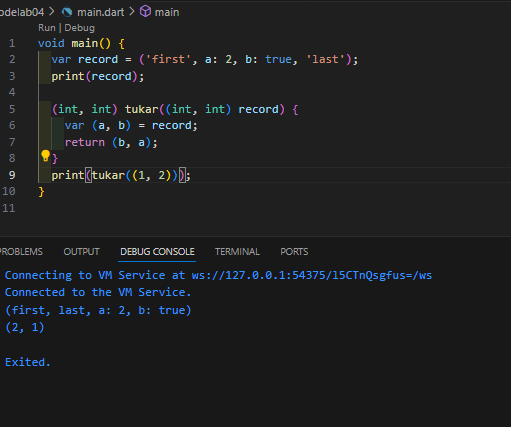

# 04 | Pengantar Bahasa Pemrograman Dart - Bagian 3

Jobsheet 4 | Pemrograman Mobile

## Praktikum 1: Eksperimen Tipe Data List

### Langkah 1

```
void main() {
  var list = [1, 2, 3];
  assert(list.length == 3);
  assert(list[1] == 2);
  print(list.length);
  print(list[1]);

  list[1] = 1;
  assert(list[1] == 1);
  print(list[1]);
}
```

### Langkah 2


Penjelasan: assert akan menghentikan program apabila error, lalu berhubung bisa semua maka di jalankan sampai akhir yang menghasilkan print 321.

### Langkah 3


Error karena final tidak bisa diubah setelah diinisiasi. Solusi :

```
void main() {
  List list = List.filled(5, null);

  list[1] = "Ekya Muhammad";
  list[2] = "2341720111";

  print(list);
  print(list[1]);
  print(list[2]);
}
```

Hasil:


## Praktikum 2: Eksperimen Tipe Data Set

### Langkah 1

```
var halogens = {'fluorine', 'chlorine', 'bromine', 'iodine', 'astatine'};
print(halogens);
```

### Langkah 2


Tidak ada yang error. Yang terjadi adalah kode ngeprint isi halogens.

### Langkah 3


Tidak ada yang error.

Hasil menambahkan dengan add() dan addAll()


## Praktikum 3:

### Langkah 1 & 2


Tidak ada yang error. yang dilakukan hanya menginisiasi variabel map dan di print.

### Langkah 3


Yang dilakukan adalah menginisiasi mhs 1 dengan key String dan nilai String serta mhs 2 dengan key int dengan nilai String.

Sisanya adalah mencoba untuk mengubah nilai map dengan key tertentu, tidak ada yang error.


## Praktikum 4: Eksperimen Tipe Data List: Spread dan Control-flow Operators

### Langkah 1 & 2


Hasilnya error karena penulisan variabelnya salah


Yang dilakukan: list diinisiasi, didalam list 2 nilai 0 dibuat lalu memasukkan seluruh nilai list setelah 0 lalu di print. Setelah itu list2 dihitung isinya.

### Langkah 3


Error karena list1 tidak nullable. Cara yang bisa dilakukan adalah menambahkan ? ke kiri null agar dapat di nullkan.


### Langkah 4

Error.


Jika true


Jika false


### Langkah 5

Error karena variabel login belum diinisiasi.

### Langkah 6


Menginisiasi nilai menggunakan for.


## Praktikum 5

## Langkah 1


Menginisiasi dan print record

## Langkah 2 & 3



## Langkah 4

Error karena tidan nullable dan tidak diinisiasi nilai.


## Langkah 5


Kode print atribute dari record

