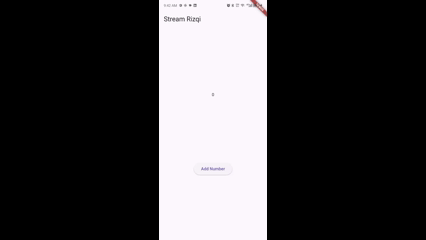
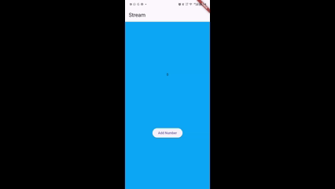
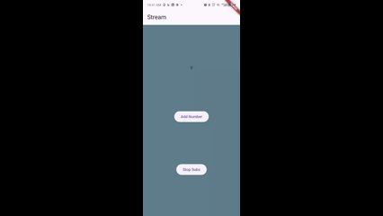
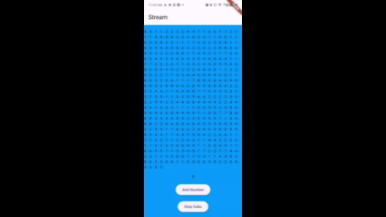
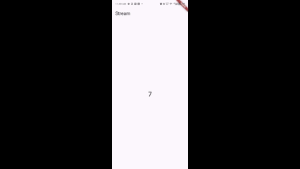
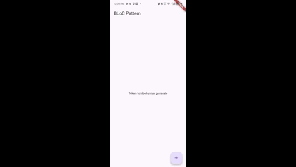

# Laporan Praktikum Flutter: State Management dengan Streams (Week 12)

## Identitas

- **Nama:** Ekya Muhammad Hasfi Fadlilurrahman
- **NIM:** 2341720111
- **Kelas:** Kelas T-3H

---

## Praktikum 1: Dart Streams

### Implementasi

Pada bagian ini, nama panggilan telah ditambahkan pada `title` aplikasi sebagai identitas. Tema warna aplikasi juga telah disesuaikan.

```dart
  title: const Text('Stream ekya'),
```

Variabel `colors` telah ditambahkan dengan 5 warna sesuai pilihan yang diinginkan. Hasilnya dapat dilihat pada demo aplikasi.

**Penjelasan Keyword `yield*`:**

Keyword `yield*` berfungsi untuk mengambil generator lain ke dalam generator yang sedang berjalan. Dengan menggunakan keyword ini, stream dari generator lain dapat diintegrasikan langsung ke dalam stream utama.

**Hasil Demo:** <br>


**Perbandingan `listen` dan `await for`:**

Metode `listen` bekerja dengan melakukan pembaruan data secara terus menerus dan responsif terhadap perubahan. Sementara itu, `await for` memproses data secara berurutan sesuai dengan urutan kedatangan event.

### Code Final

**main.dart:**

```dart
import 'package:flutter/material.dart';
import 'stream.dart';

void main() {
  runApp(const MyApp());
}

class MyApp extends StatelessWidget {
  const MyApp({super.key});

  @override
  Widget build(BuildContext context) {
    return MaterialApp(
      title: 'Stream',
      theme: ThemeData(
        primarySwatch: Colors.deepPurple,
      ),
      home: const StreamHomePage(),
    );
  }
}

class StreamHomePage extends StatefulWidget {
  const StreamHomePage({super.key});

  @override
  State<StreamHomePage> createState() => _StreamHomePageState();
}

class _StreamHomePageState extends State<StreamHomePage> {
  Color bgColor = Colors.blueGrey;
  late ColorStream colorStream;

  @override
  void initState() {
    super.initState();
    colorStream = ColorStream();
    changeColor();
  }

  void changeColor() async {
    await for (var eventColor in colorStream.getColors()) {
      setState(() {
        bgColor = eventColor;
      });
    }
  }

  @override
  Widget build(BuildContext context) {
    return Scaffold(
      appBar: AppBar(
        title: const Text('Stream'),
      ),
      body: Container(
        decoration: BoxDecoration(color: bgColor),
      ),
    );
  }
}

```

**stream.dart:**

```dart
import 'package:flutter/material.dart';

class ColorStream {
  final List<Color> colors = [
    Colors.blueGrey,
    Colors.amber,
    Colors.deepPurple,
    Colors.lightBlue,
    Colors.teal,
  ];

  Stream<Color> getColors() async* {
    yield* Stream.periodic(const Duration(seconds: 1), (int t) {
      int index = t % colors.length;
      return colors[index];
    });
  }
}
```

---

## Praktikum 2: Stream Controllers dan Sinks

### Implementasi

**Penjelasan Kode:**

Pada langkah 8, implementasi difokuskan pada penggunaan stream untuk mengelola aliran data. Langkah 10 menunjukkan proses generate random number yang kemudian dikirimkan ke stream untuk diproses lebih lanjut.

**Hasil Demo:**


**Penjelasan Langkah 13-15:**

Langkah 13 menunjukkan pembuatan function `addError()` untuk menangani kesalahan. Pada langkah 15, implementasi dimodifikasi sehingga error dapat ditampilkan langsung pada layar aplikasi. Kode telah dikembalikan ke kondisi semula dengan melakukan comment pada `addError()` untuk melanjutkan ke praktikum berikutnya.

### Code Final

**stream.dart (tambahan NumberStream class):**

```dart
import 'dart:async';

class NumberStream {
  final _streamController = StreamController<int>();

  void addNumberToSink(int number) {
    _streamController.sink.add(number);
  }

  Stream<int> get stream => _streamController.stream;

  void close() {
    _streamController.close();
  }
}
```

**main.dart (modifikasi pada initState dan tambah method):**

```dart
  int lastNumber = 0;
  late StreamController numberStreamController;
  late NumberStream numberStream;

  @override
  void initState() {
    numberStream = NumberStream();
    numberStreamController = numberStream.controller;
    Stream stream = numberStreamController.stream;
    stream.listen((event) {
      setState(() {
        lastNumber = event;
      });
    });
    super.initState();
  }

  @override
  void dispose() {
    numberStream.close();
    super.dispose();
  }

  void addRandomNumber() {
    Random random = Random();
    int myNum = random.nextInt(10);
    numberStream.addNumberToSink(myNum);
  }

  @override
  Widget build(BuildContext context) {
    return Scaffold(
      appBar: AppBar(title: const Text('Stream ekya')),
      body: SizedBox(
        width: double.infinity,
        child: Column(
          mainAxisAlignment: MainAxisAlignment.spaceEvenly,
          crossAxisAlignment: CrossAxisAlignment.center,
          children: [
            Text(lastNumber.toString()),
            ElevatedButton(onPressed: addRandomNumber, child: const Text('Add Number'))
          ],
        ),
      ),
    );
  }
```
---

## Praktikum 3: Injeksi Data ke Streams

### Implementasi

**Penjelasan Kode:**

Langkah 1-3 mendemonstrasikan penerapan transform pada stream. Transform digunakan untuk memodifikasi data yang mengalir melalui stream sebelum sampai ke listener.

**Hasil Demo:**



### Code Final

**main.dart (tambahan variabel dan initState):**

```dart
late StreamTransformer transformer;

@override
void initState() {
  super.initState();
  transformer = StreamTransformer<int, int>.fromHandlers(
    handleData: (value, sink) {
      sink.add(value * 10);
    },
    handleError: (error, trace, sink) {
      sink.add(-1);
    },
    handleDone: (sink) => sink.close(),
  );

  stream.transform(transformer).listen((event) {
      setState(() {
        lastNumber = event;
      });
    }).onError((error) {
      setState(() {
        lastNumber = -1;
      });
    });
}
```
---

## Praktikum 4: Subscribe ke Stream Events

### Implementasi

**Penjelasan Kode:**

Langkah 2, 6, dan 8 menunjukkan penerapan subscription pada stream. Subscription memungkinkan aplikasi untuk mendengarkan dan merespons event yang terjadi pada stream secara lebih terkontrol.

**Hasil Demo:**



### Code Final

**main.dart (modifikasi initState dengan Subscription):**

```dart
late StreamSubscription subscription;

@override
void initState() {
  super.initState();
  subscription = numberStream.stream.listen((event) {
    setState(() {
      lastNumber = event;
    });
  }, onError: (error) {
    // Handle error
  }, onDone: () {
    // Handle done
  });
}

@override
void dispose() {
  subscription.cancel();
  super.dispose();
}
```
---

## Praktikum 5: Multiple Stream Subscriptions

### Implementasi

**Analisis Error:**

Error terjadi karena terdapat 2 listener yang mencoba mengakses stream yang sama. Untuk mengatasi masalah ini, salah satu listener perlu dihapus atau stream harus diubah menjadi broadcast stream agar dapat menangani multiple subscriptions.

**Hasil Demo:**



### Code Final

**main.dart (menggunakan broadcast stream):**

```dart
late StreamSubscription subscription2;
String values = '';

@override
void initState() {
  super.initState();
  subscription = stream.listen((event) {
    setState(() {
      values += '$event - ';
    });
  });

  subscription2 = stream.listen((event) {
    setState(() {
      values += '$event - ';
    });
  });
}
```
---

## Praktikum 6: StreamBuilder

### Implementasi

**Penjelasan Kode:**

Langkah 3 dan 7 mendemonstrasikan penerapan stream pada builder. StreamBuilder digunakan untuk membangun UI secara reaktif berdasarkan data yang mengalir melalui stream, sehingga tampilan aplikasi dapat diperbarui secara otomatis ketika ada perubahan data.

**Hasil Demo:**


### Code Final

**stream.dart (NumberStream class):**

```dart
import 'dart:math';
import 'dart:async';

class NumberStream {
  Stream<int> getNumbers() async* {
    yield* Stream.periodic(const Duration(seconds: 1), (int t) {
      Random random = Random();
      int myNum = random.nextInt(10);
      return myNum;
    });
  }
}
```

**main.dart (menggunakan StreamBuilder):**

```dart
@override
Widget build(BuildContext context) {
  return Scaffold(
    appBar: AppBar(title: const Text('StreamBuilder')),
    body: StreamBuilder<int>(
      stream: numberStream.getNumbers(),
      builder: (context, snapshot) {
        if (snapshot.hasData) {
          return Center(
            child: Text(
              snapshot.data.toString(),
              style: const TextStyle(fontSize: 64),
            ),
          );
        } else {
          return const Center(child: CircularProgressIndicator());
        }
      },
    ),
  );
}
```
---

## Praktikum 7: BLoC Pattern

### Implementasi

**Konsep BLoC Pattern:**

Praktikum ini mendemonstrasikan implementasi pola BLoC (Business Logic Component). Konsep pola BLoC terletak pada struktur file yang memisahkan business logic dari UI. Alur data tidak langsung terhubung antara main dan screen, melainkan melalui layer BLoC terlebih dahulu. Pemisahan ini memungkinkan pengelolaan state yang lebih terorganisir dan mudah dimaintain.

**Hasil Demo:**



### Code Final

**random_bloc.dart:**

```dart
import 'dart:async';
import 'dart:math';

class RandomNumberBloc {
  final _streamController = StreamController<int>();

  Stream<int> get stream => _streamController.stream;

  void generateNumber() {
    Random random = Random();
    int number = random.nextInt(10);
    _streamController.sink.add(number);
  }

  void dispose() {
    _streamController.close();
  }
}
```

**random_screen.dart:**

```dart
import 'package:flutter/material.dart';
import 'random_bloc.dart';

class RandomScreen extends StatefulWidget {
  const RandomScreen({super.key});

  @override
  State<RandomScreen> createState() => _RandomScreenState();
}

class _RandomScreenState extends State<RandomScreen> {
  late RandomNumberBloc bloc;

  @override
  void initState() {
    super.initState();
    bloc = RandomNumberBloc();
  }

  @override
  void dispose() {
    bloc.dispose();
    super.dispose();
  }

  @override
  Widget build(BuildContext context) {
    return Scaffold(
      appBar: AppBar(title: const Text('BLoC Pattern')),
      body: Center(
        child: StreamBuilder<int>(
          stream: bloc.stream,
          builder: (context, snapshot) {
            if (snapshot.hasData) {
              return Text(
                snapshot.data.toString(),
                style: const TextStyle(fontSize: 64),
              );
            } else {
              return const Text('Tekan tombol untuk generate');
            }
          },
        ),
      ),
      floatingActionButton: FloatingActionButton(
        onPressed: () => bloc.generateNumber(),
        child: const Icon(Icons.add),
      ),
    );
  }
}
```
---
